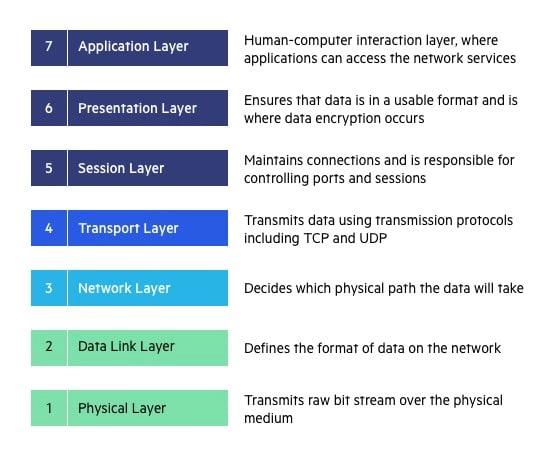
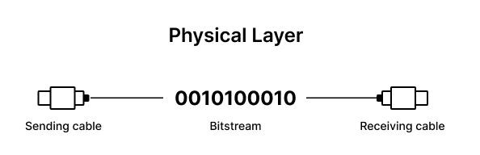
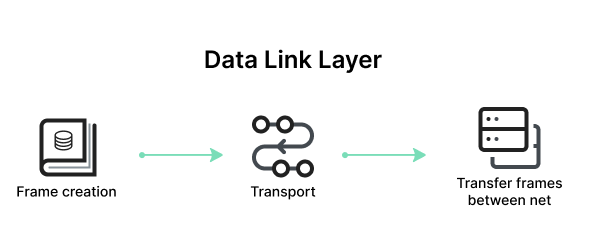
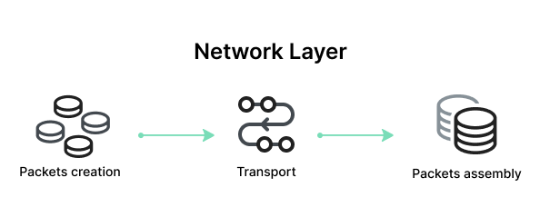
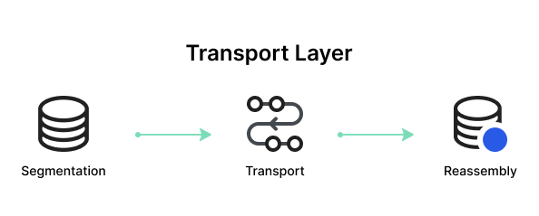
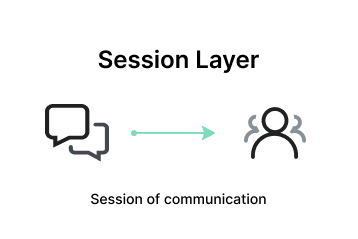
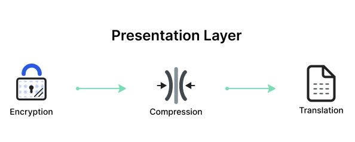
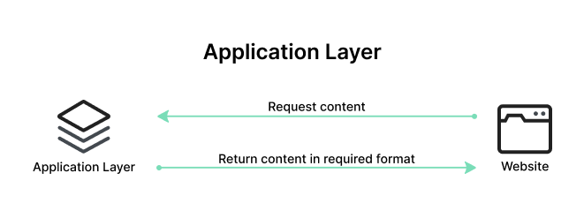

## What is network?
-> Networking is the practice of connecting computers and devices to share resources and information.

-> Network is a collection of interconnected devices that communicate with each other to share resources and information.

## Basic elements of network
- Network: A group of devices (e.g., computers, servers, routers) connected to share data and resources.
- Node: Any device in the network, like a computer, printer, or router.
- Host: A device capable of sending or receiving data on the network.

### Types of Networks
1. LAN (Local Area Network):
- Covers a small geographical area (e.g., a home, office).
- High speed and low latency.
Example: Wi-Fi in a home.

2. WAN (Wide Area Network):
- Covers large geographical areas (e.g., the internet).
- Lower speed and higher latency compared to LAN.

3. MAN (Metropolitan Area Network):
- Spans a city or campus.
4. PAN (Personal Area Network):
- Small network for personal devices (e.g., Bluetooth).

## Networking Models
- OSI (Open Systems Interconnection) Model: 7-layer model for network communication.

1. Physical Layer:Deals with hardware transmission (e.g., cables, switches).
Converts data into electrical signals or light pulses.

2. Data Link Layer:Manages node-to-node data transfer.
Error detection and MAC (Media Access Control) addressing.

3. Network Layer:Handles routing and addressing.
Protocols: IP (Internet Protocol).

4. Transport Layer:Ensures reliable data delivery.
Protocols: TCP (Transmission Control Protocol), UDP (User Datagram Protocol).

5. Session Layer:Manages sessions between applications.

6. Presentation Layer:Ensures data is in a readable format (e.g., encryption, compression).

7. Application Layer:Interfaces directly with the user.
Protocols: HTTP, FTP, SMTP.

## TCP/IP Model
- A simplified model used in real-world networking:

1. Application Layer: Combines OSI's application, presentation, and session layers.
2. Transport Layer: Same as OSI's transport layer.
3. Internet Layer: Similar to OSI's network layer.
4. Network Access Layer: Combines OSI's physical and data link layers.

## Key Networking Devices
- Router:Connects multiple networks.
Routes data packets based on IP addresses.
- Switch:Connects devices within a LAN.
Uses MAC addresses for communication.
- Hub:Basic device for connecting devices.
Sends data to all connected devices (inefficient).
- Modem:Converts analog signals to digital for internet access.
- Access Point:Provides wireless connectivity in a network.
